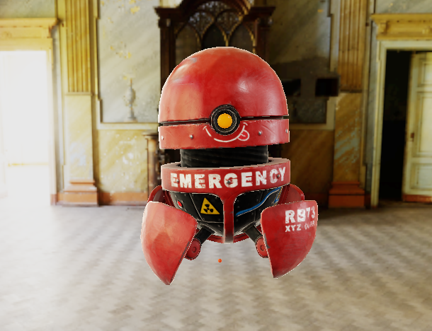
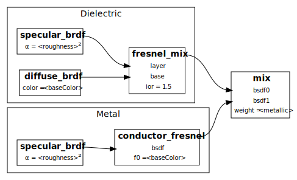
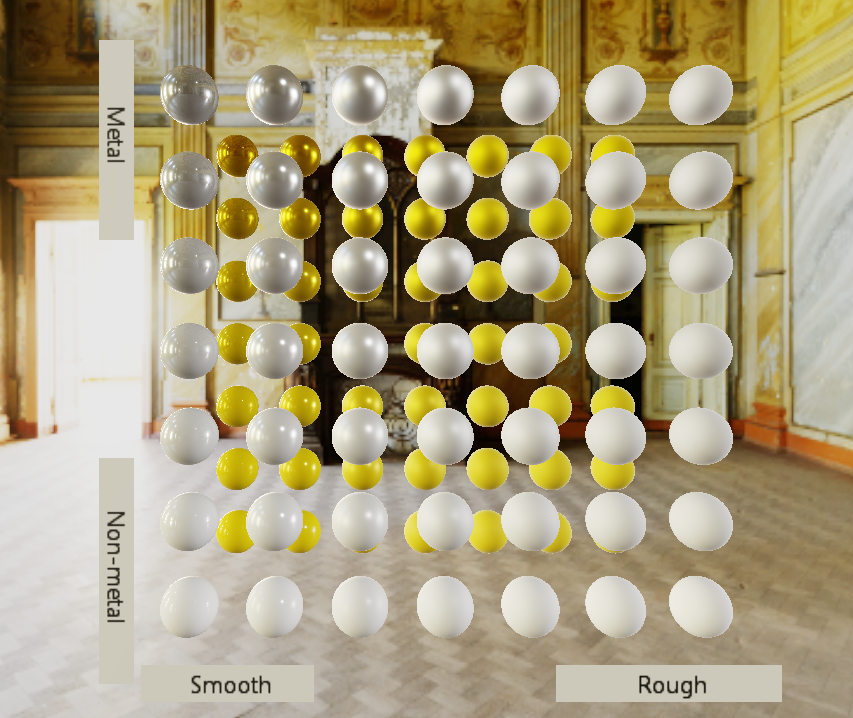
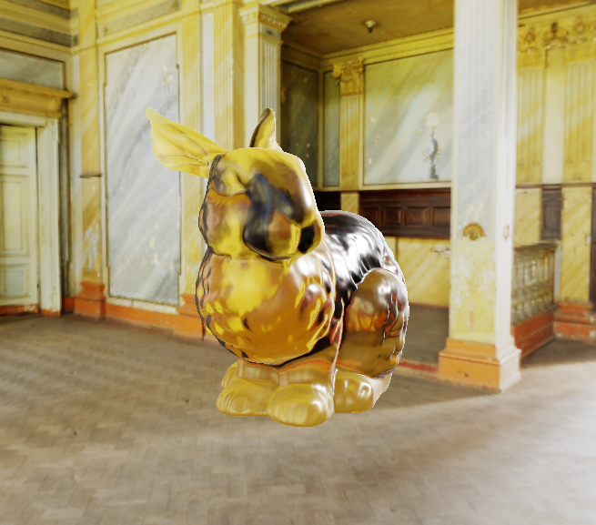
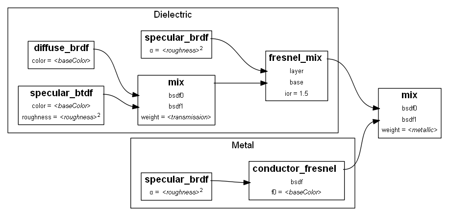
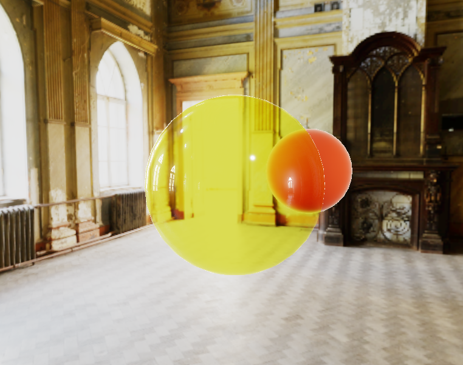
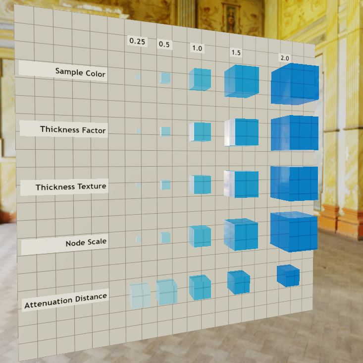

# Notes on Writing glTF PBR

These notes are my own personal summary on a rewrite of my PBR shaders to be a bit more maintainable, readable, and accurate. My approach was to follow the definition of PBR as defined in Appendix B of the glTF 2.0 specification as closely as possible. As these notes here are a companion guide to Appendix B and a few extensions, this is intentionally implementation heavy and closer to a code review/walkthrough. I try to emphasize any important observations along the way. Sample code is provided below in GLSL.



*RB-73 Model created by @forpinik ([Sketchfab](https://skfb.ly/6StXO))*

## Core glTF 2.0 PBR (Metallic-Roughness)

The key starting point for this glTF PBR rewrite was to begin in Appendix B of the [glTF specification](https://registry.khronos.org/glTF/specs/2.0/glTF-2.0.html#appendix-b-brdf-implementation), implementing core glTF 2.0 closest to the intent of the Khronos PBR working group. Understand that this particular implementation aims to convey spirit of the material rather than promoting optimizations and PBR/optimization witchraft. Perfect for my use.

Rather than recite Appendix B back here, I'll simply fill in the blanks. Below I document a summary of the nuts and bolts of my approach, any bugs are my own. I'll start at a high level overview of how punctual lighting (spot, point, direction lights) are modeled after Appendix B, and drill down into each of these building blocks individually. First we need to calculate the specular and diffuse surface reflections, which will then be the core inputs into dielectric and metallic brdfs. The final color is selected based on the metallic value defined on the material.

The code below follows the BRDF diagram shown in Appendix B:



*Core PBR material diagram, from Appendix B of the glTF 2.0 specification*

```GLSL
    float specularBrdf = specular_brdf(alphaRoughness, NdotL, NdotV, NdotH, LdotH, VdotH);
    vec3 f_specular = NdotL * vec3(specularBrdf);
    vec3 f_diffuse = NdotL * diffuse_brdf(baseColor.rgb);

    vec3 dielectric_brdf = 
        fresnel_mix(
            pbrInputs.ior,
            f_diffuse,          // base
            f_specular,         // layer
            VdotH);

    vec3 metal_brdf = 
        conductor_fresnel(
            baseColor.rgb,      // f0
            f_specular,         // bsdf
            VdotH);

    vec3 color = mix(dielectric_brdf, metal_brdf, metallic);
```

Note the addition of NdotL factor to f_specular and f_diffuse above, which ensures that these terms are only visible on the surfaces that face the light source. Special care must be taken to ensure that these dot products are clamped to 0.0, or sometimes to a small 0.0001 for cases when the dot product is used in the denominator.

Diffuse and specular brdfs follow exactly as defined in Appendix B.
```GLSL
vec3 diffuse_brdf(vec3 color)
{
    return (1.0 / c_Pi) * color;
}

float specular_brdf(float alphaRoughness, float NdotL, float NdotV, float NdotH, float LdotH, float VdotH)
{
    float G = geometricOcclusion(alphaRoughness, NdotL, NdotV, LdotH, VdotH);
    float V = G / (4.0 * abs(NdotL) * abs(NdotV));
    float D = microfacetDistribution(alphaRoughness, NdotH);

    return V * D;
}
```

The geometricOcclusion (G) and microfacetDistribution (D) functions are defined in the SIGGRAPH 2013 course notes on PBR by Epic Games.

```GLSL
// The following equation models the distribution of microfacet normals across the area being drawn (aka D())
// Implementation from "Average Irregularity Representation of a Roughened Surface for Ray Reflection" by T. S. Trowbridge, and K. P. Reitz
// Follows the distribution function recommended in the SIGGRAPH 2013 course notes from EPIC Games, Equation 3.
float microfacetDistribution(float alphaRoughness, float NdotH)
{
    float alphaRoughnessSq = alphaRoughness * alphaRoughness;
    float f = NdotH * NdotH * (alphaRoughnessSq - 1.0) + 1.0;

    float hs = heaviside(NdotH);
    return hs * alphaRoughnessSq / (c_Pi * f * f);
}

// This calculates the specular geometric attenuation (aka G())
// where rougher material will reflect less light back to the viewer.
// This implementation is based on SIGGRAPH 2013 course notes from EPIC Games Equation 4
// Note that G has been confused with Vis.  Sample Viewer uses Vis = (G / (4 * NdotL * NdotV))
// If this ever gets switched to Vis, be sure to drop the 4 * NdotL * NdotV normalization term
float geometricOcclusion(float alphaRoughness, float NdotL, float NdotV, float LdotH, float VdotH)
{
    float alphaRoughnessSq = alphaRoughness * alphaRoughness;
    // Positive characteristic function: one if a > 0 and zero if a <= 0
    float hs_l = heaviside(LdotH);
    float hs_v = heaviside(VdotH);

     float attenuationL = 2.0 * abs(NdotL) / (abs(NdotL) + sqrt(alphaRoughnessSq + (1.0 - alphaRoughnessSq) * (NdotL * NdotL)));
     float attenuationV = 2.0 * abs(NdotV) / (abs(NdotV) + sqrt(alphaRoughnessSq + (1.0 - alphaRoughnessSq) * (NdotV * NdotV)));
     return hs_l * hs_v * attenuationL * attenuationV;
}
```

Use of the heaviside function is here to stay true to the implementation defined in AppendixB. It is also common to see this function left out, as many other implementations guard against all of these calculations much earlier by testing against `NdotV` and `NdotL`. There is no need to evaluate the surface BRDF if the viewer is on the backside of the surface, which can be satisified by adding an `if (NdotV > 0.0)` guard around our brdf calculations above. The same is true for lighting; lights on the opposite side of the surface can be tested and thrown out by adding a test for `if (NdotL > 0.0)`. This is true if our material is only concerned about surface reflections, but below we will add support for thin-walled transmissive surfaces, which can be evaluated from both sides of the surface.

For completion, I'll wrap up with my implementations of `conductor_fresnel` and `fresnel_mix`:

```GLSL
vec3 conductor_fresnel(vec3 f0, vec3 bsdf, float VdotH)
{
    vec3 f90 = vec3(1.0);
    float invVoH = clamp(1.0 - VdotH, 0.0, 1.0);
    float pow5 = invVoH * invVoH * invVoH * invVoH * invVoH;
    return bsdf * (f0 + (f90 - f0) * pow5);
}

vec3 fresnel_mix(float ior, vec3 base, vec3 layer, float VdotH)
{
    float f0 = ((1.0 - ior) / (1.0 + ior)) * ((1.0 - ior) / (1.0 + ior));

    float invVoH = 1.0 - abs(VdotH);
    float pow5 = invVoH * invVoH * invVoH * invVoH * invVoH;
    float fr = f0 + (1.0 - f0) * pow5;

    return mix(base, layer, fr);
}
```

## Adding Image-Based Lighting
The technique for Image-Based Lighting (IBL) is largely based off of the [SIGGRAPH 2013 course notes](https://blog.selfshadow.com/publications/s2013-shading-course/karis/s2013_pbs_epic_notes_v2.pdf) by Brian Karis at Epic Games. An approachable supplemental overview can also be found at [learnopengl.com](https://learnopengl.com/PBR/IBL/Diffuse-irradiance). There are several different alternative approaches to IBL available depending on your target hardware and runtime criteria. Emmett Lalish from Google developed a novel approach to IBL in three.js that is fast enough to be computed on the fly at runtime. Cesium.js also has (or experimented with) an implementation that encodes the environment maps into an octahedron, which can be unrolled into a 2D texture (this technique is known as oct-encoding). I just stuck with what I had originally written years ago and is well documented online. The approach I use is energy conserving thanks to the excellent summary presented by [Bruno Opsenica](https://bruop.github.io/ibl/#single_scattering_results).

First I'll present how surface light contributions are calculated for both the irradiance and the specular BRDF.

```GLSL
// IBL Irradiance represents the average lighting from any direction.
vec3 ibl_irradiance(vec3 diffuseColor, vec3 n, float roughness, float NdotV, vec3 F0, vec2 brdfLUT)
{
    n =  mat3(pbrInputs.environmentMapTransform) * n;
    vec3 diffuseLight = texture(u_IrradianceEnvSampler, n).rgb;

    // The following models energy conservation for IBL
    // see https://bruop.github.io/ibl/
    // ss = single scattering, ms = multiple scattering
    vec3 Fr = max(vec3(1.0 - roughness), F0) - F0;
    vec3 k_S = F0 + Fr * pow(1.0 - NdotV, 5.0);
    vec3 FssEss = k_S * brdfLUT.x + brdfLUT.y;

    // Multiple scattering, from Fdez-Aguera
    float Ems = (1.0 - (brdfLUT.x + brdfLUT.y));
    vec3 F_avg = F0 + (1.0 - F0) / 21.0;
    vec3 FmsEms = Ems * FssEss * F_avg / (1.0 - F_avg * Ems);
    vec3 k_D = diffuseColor * (1.0 - FssEss + FmsEms);

    return (FmsEms + k_D) * diffuseLight;
}

vec3 ibl_specular(float roughness, vec3 n, vec3 v, vec3 F0, vec2 brdfLUT)
{
    const float roughnessOneLOD = c_MaxLod - 1.0; // c_MaxLod contains the diffuseIBL
    float lod = roughnessOneLOD * roughness * (2.0 - roughness);
    vec3 reflection = normalize(reflect(-v, n));
    reflection = mat3(pbrInputs.environmentMapTransform) * reflection;
    reflection = normalize(reflection);
    vec3 specularLight = textureLod(u_SpecularEnvSampler, reflection, lod).rgb;

    // The following models energy conservation for IBL
    // see https://bruop.github.io/ibl/
    // ss = single scattering, ms = multiple scattering
    vec3 Fr = max(vec3(1.0 - roughness), F0) - F0;
    vec3 k_S = F0 + Fr * pow(1.0 - dot(n,v), 5.0);
    vec3 FssEss = k_S * brdfLUT.x + brdfLUT.y;

    return specularLight * FssEss;
}
```

Below I show how these terms are combined with the results of punctual lighting covered earlier in this document.

```GLSL
    vec2 uv = clamp(vec2(abs(NdotV), 1.0 - perceptualRoughness), vec2(0.0, 0.0), vec2(1.0, 1.0));
    vec2 brdfLUT = texture(u_brdfLUT, uv).rg;

    float specularBrdf = specular_brdf(alphaRoughness, NdotL, NdotV, NdotH, LdotH, VdotH);
    vec3 f_specular = NoL * vec3(specularBrdf);
    vec3 f_diffuse = NoL * diffuse_brdf(baseColor.rgb);

    vec3 iblIrradiance = ibl_irradiance(
        diffuseColor, 
        n, 
        perceptualRoughness, 
        NoV, 
        reflectanceF0, 
        brdfLUT);

    vec3 iblSpecularColor = ibl_specular(
        perceptualRoughness, 
        n, 
        v, 
        reflectanceF0, 
        brdfLUT);

    vec3 dielectric_brdf = 
        fresnel_mix(
            pbrInputs.ior,
            f_diffuse,          // base
            f_specular,         // layer
            VdotH);

    vec3 metal_brdf = 
        conductor_fresnel(
            baseColor.rgb,      // f0
            f_specular,         // bsdf
            VdotH);

    dielectric_brdf += iblIrradiance + iblSpecularColor;
    metal_brdf += iblIrradiance + iblSpecularColor;
    vec3 color = mix(dielectric_brdf, metal_brdf, metallic);
```

As you can see, the approach I took was to combine irradiance (average light from all directions) and specular IBL contributions with the dielectric and metallic BRDFs at the end.

To evaluate these core properties, you'll want to grab some sample models from the [glTF-Sample-Models](https://github.com/KhronosGroup/glTF-Sample-Models) repository up on github. Here you'll find a curated set of models that are meant to showcase a particular effect possible with glTF materials, as well as a collection of conformance models. The conformance models are fantastic for engine development, as they are designed to highlight common problems and considerations when implementing these effects. Below is a rendering of the [MetalRoughSpheres Test](https://github.com/KhronosGroup/glTF-Sample-Models/tree/master/2.0/MetalRoughSpheres).



## Extending Metallic-Roughness for Transmission

For modeling glass like surfaces, we need to extend the core metallic roughness model to include transmission. The [KHR_materials_transmission](https://github.com/KhronosGroup/glTF/tree/main/extensions/2.0/Khronos/KHR_materials_transmission) extension allows for light to transmit through the surface. That might sound like alpha blending to some, but these two concepts are very different. In short, alpha blending is used to model the precense or absence of the material (think screen door). 50% alpha implies that only 50% of the material occupies the fragment. If that surface was shiny, you would only render 50% of that shiny surface and lose half of the highlight. For transmission, the entire material is present but we now signal to the renderer that light travels through the surface and we must therefore combine surface highlights, tint, etc on this material with the scene that exists behind this fragment. This is covered in our [Khronos webinar](https://www.khronos.org/events/advanced-pbr-material-parameters-in-gltf) and in the specification.

In isolation, the transmission extension models the effect known as "thin-walled" transmission, where the transmissive surface is "infinitely thin" and no value of IOR would result in refraction. This material has its uses, such as glass windows, but it is typically paired with the `KHR_materials_volume` extension covered later.

### Preparing the offscreen opaque scene for Transmission



*Stanford Bunny model, with hand edited material to include absorption and refraction*

The illusion of revealing a scene behind transmission fragments is achieved through a rasterization technical called Screen Space Refraction (SSR). At it's core, this technique requires that we render the scene to an offscreen texture in one pass without rendering any transmissive materials. You can think of this offscreen texture as representing the background scene that can be viewed through a transmissive material. From a physical standpoint, this texture is a capture of all of the linear light values eminating from our scene, and we will sample this scene when rendering transmissive fragments to gather inputs on how much linear light will be transmitted through the material and tinted by the `baseColorFactor` of the surface. With this understanding, it is important to note that this offscreen texture must use a Linear representation; UNORM and not SRGB.

After the offscreen scene is rendered, the texture must be mipmapped. Miplevels are accessed based on the level of roughness on the transmissive material. Regardless of the aspect ratio of the screen, I will always render to a 1024x1024 sized texture, ensuring that this step is not fill-rate sensitive to screen resolution and that we will always have a known number of mip-levels for this scene.

See the second half of our [Khronos webinar](https://www.khronos.org/events/advanced-pbr-material-parameters-in-gltf) for the overview of how this was implemented in the glTF Sample Viewer.

### Shader updates for transmission.

Transmission extends the core glTF model by inserting a new node, the `specular_btdf` (Bi-directional Transmission Function); the glTF model will provide a `transmissionFactor` that we will use to blend between the `diffuse_brdf` and the `specular_btdf`. The diagram from above is extended to add the `specular_btdf` (diagram pulled from the extension).



For completeness, I've also listed helper functions for a clamped dot product; the second variation is there to avoid divide-by-zero errors.

```GLSL
float heaviside(float v)
{
    // return 1.0 if v is > 0, 0.0 otherwise
    return clamp(sign(v), 0.0, 1.0);
}

float clampdot(vec3 a, vec3 b)
{
    return clamp(dot(a, b), 0.0, 1.0);
}

float clampdot2(vec3 a, vec3 b)
{
    return clamp(dot(a, b), 0.0001, 1.0);
}

float specular_btdf(float alphaRoughness, vec3 n, vec3 l, vec3 v, float ior)
{
    l = l + 2.0 * n * (dot(-l, n)); // mirror light reflection vector on surface
    vec3 Ht = normalize(v + l);

    float D_heaviside = heaviside(clampdot(n,Ht));
    float G_heaviside = heaviside(clampdot(Ht,v) / clampdot2(n,v));
    
    float Dt = D_heaviside * microfacetDistribution(alphaRoughness, clampdot(n,Ht));
    float Gt = G_heaviside * geometricOcclusion(alphaRoughness, clampdot(n,l), clampdot(n,v), clampdot(l,Ht), clampdot(v,Ht));

    float Vt = Gt / (4.0 * abs(dot(n,l)) * abs(dot(n,v))); 

    return clampdot(n, l) * Vt * Dt;
}
```

The specular_btdf should look very familiar, this is essentially the specular_brdf function, but we've modified it to be calculated with the light vector mirrored on the surface, and flipped our hemisphere of acceptable values (via the `heaviside`). The `microfacetDistribution` and `geometricOcclusion` are the same functions defined above. You may be tempted to simplify things and send different inputs into the specular_brdf function, but that unused `float ior` input is foreshadowing for changes that we will make to extend this effect to include refraction. 

To factor the `specular_btdf` into our material, we will need to mix the resulting value with the `diffuse_brdf` based on the transmissionFactor defined on the material.

```GLSL
    float transmissionFactor = pbrInputs.transmissionFactor;
    transmissionFactor *= texture(u_TransmissionSampler, texCoords).r;
    vec3 f_transmission = specular_btdf(alphaRoughness, n, l, v, pbrInputs.ior) * baseColor.rgb;
    f_diffuse = mix(f_diffuse, f_transmission, transmissionFactor);
```

No surprises here. In my implementation, I will bind a 1x1 white texture to the u_TransmissionSampler descriptor set if there is no transmission texture available. This is merely to reduce the number of shader permutations required. For transmission surfaces, we also require a slightly modified `fresnel_mix` to use the modified half-vector.

```GLSL
    vec3 fresnel_mix(float ior, vec3 base, vec3 layer, vec3 n, vec3 l, vec3 v)
    {
        l = l + 2.0 * n * (dot(-l, n)); // mirror light reflection vector on surface
        vec3 Ht = normalize(v + l);

        float f0 = ((1.0 - ior) / (1.0 + ior)) * ((1.0 - ior) / (1.0 + ior));

        float invVoH = 1.0 - abs(clampdot(v, Ht));
        float pow5 = invVoH * invVoH * invVoH * invVoH * invVoH;
        float fr = f0 + (1.0 - f0) * pow5;

        return mix(base, layer, fr);
    }
```

At a minimum, rasterizers like this implementation must "reveal" the opaque scene through a transmission surface. More advanced renders may take this requirement further by rendering layers upon layers of transmission materials to allow for stacking of the effect, though it is really hard to get this right. It turns out that modeling a mug of beer is really hard!. 

Below is how I sample into the offscreen scene of opaque objects. This scene includes the Skybox and all solid objects, rendered to a 1024x1024 UNORM texture. Emphasis added to the UNORM, as this buffer isn't here to represent colors, but linear light values from this scene. As this scene is a mipmapped texture, each level in the mipmap tree contains a lower resolution and blurrier scene from the level above. As roughness increases, we want to sample into these lower levels. Note that this LOD selection is also influenced by the IOR of the material to retain two key properties; (1) as IOR approaches 1.0 sensitivity to roughness matters less (1.0 is air and we will always sample miplevel 0), and (2) a default IOR of 1.5 represents our identity value for IOR influence (no skew).

```GLSL
vec3 ibl_transmission(float roughness, float ior, vec3 absorptionColor, vec3 v, vec3 n)
{
    const float maxLod = 6; // scene is now always 1024x1024 with mipLevels = 10 ... 10 is too low of a mip level so raise the floor to miplevel 6
    const float roughnessOneLOD = maxLod - 1.0;
    // maps 1.0 ior to LOD 0, and 1.5 ior (default) to put IOR influence at 1.0
    const float iorLODInfluence = (ior - 1.0) * 2.0;
    float lod = iorLODInfluence * roughnessOneLOD * roughness * (2.0 - roughness);
    vec2 uv = gl_FragCoord.xy / scene.viewport.zw;

    vec3 transmittedLight = textureLod(u_TransmissionScene, uv, lod).rgb;
    vec3 transmittanceColor = transmittedLight * absorptionColor;
    return transmittanceColor;
}
```

I understand that calling this function "ibl" is a stretch, as it has nothing to do with our IBL cubemap. As this transmission scene is storing linear light values from a background scene, referring to this texture as 'ibl' isn't terrible, so it stays. You'll see below that it just fits in nicely with our other IBL sampling. Note that as covered above for the punctual lighting case, iblTransmission is not a component of the metal_brdf.

```GLSL
    vec3 iblTransmission = transmissionFactor * ibl_transmission(
        perceptualRoughness, 
        pbrInputs.ior, 
        baseColor.rgb, 
        v,
        n);

    vec3 dielectricIblColor = mix(iblIrradiance, iblTransmission, transmissionFactor);
    dielectric_brdf += dielectricIblColor + iblSpecularColor;
    metal_brdf += iblIrradiance + iblSpecularColor;
    vec3 color = mix(dielectric_brdf, metal_brdf, metallic);
```

Here is a very simple scene, where I've hand edited a glTF model of a yellow sphere to define a transmission factor of 1.0. This scene includes a red ball in the background, showing that an opaque scene (all non-transmission objects) are visibile through this transmission material.



## Extending Transmission to include Refractive Volumes

Extending thin-walled transmission to support refractive volumes (thick transmission) doesn't require much more work. The [KHR_materials_volume](https://github.com/KhronosGroup/glTF/tree/main/extensions/2.0/Khronos/KHR_materials_volume) extension allows models to define properties that are required to achieve this effect, light absorption (`attenuationColor` and `attenuationDistance`) and a rasterization helper property for defining thickness (`thicknessFactor` and `thicknessTexture`). These properties are used in the `specular_btdf`, `fresnel_mix`, and `ibl_transmission` functions. The nuances of absorption are covered well in the [AttenuationTest](https://github.com/KhronosGroup/glTF-Sample-Models/tree/master/2.0/AttenuationTest) sample model.



I almost forgot to mention that this extension requires the presence of [KHR_materials_ior](https://github.com/KhronosGroup/glTF/tree/main/extensions/2.0/Khronos/KHR_materials_ior), which is a simple extension that delivers us a configurable index of refraction property. It exists as a separate extension because IOR also effects surface reflectivity, with higher values of IOR producing a greater specular response. It is a simple scalar value, and will carry through into the shader as a uniform value for the material.

```GLSL
float specular_btdf(float alphaRoughness, vec3 n, vec3 l, vec3 v, float ior)
{
    float ior_i = 1.0; // assumes air on the incident ior (outside volume)
    float ior_o = 1.0; // ior of volume. by default a value of 1.0 disables refraction.
    vec3 Ht = vec3(0.0);

    // Volume
    if (UseVolume)
    {
        ior_i = 1.0; // assumes air on the incident ior (outside volume)
        ior_o = ior; // ior of the volume
        Ht = -normalize(ior_i * v + ior_o * l);
    }
    else // thin walled
    {
        l = l + 2.0 * n * (dot(-l, n)); // mirror light reflection vector on surface
        Ht = normalize(v + l);
    }

    float D_heaviside = heaviside(clampdot(n,Ht));
    float G_heaviside = heaviside(clampdot(Ht,v) / clampdot2(n,v));
    
    float Dt = D_heaviside * microfacetDistribution(alphaRoughness, clampdot(n,Ht));
    float Gt = G_heaviside * geometricOcclusion(alphaRoughness, clampdot(n,l), clampdot(n,v), clampdot(l,Ht), clampdot(v,Ht));

    float Vt = Gt / (4.0 * abs(dot(n,l)) * abs(dot(n,v))); 

    // Volume
    if (UseVolume)
    {
        float volumeNormalizeTerm = (abs(dot(Ht, l)) * abs(dot(Ht, v))) / (abs(dot(n, l)) * abs(dot(n, v)));
        float denominator = ior_i * clampdot2(Ht, v) + ior_o * clampdot2(Ht, l);
        Vt = volumeNormalizeTerm * (ior_o * ior_o * Gt) / (denominator * denominator);
    }
    return clampdot(n, l) * Vt * Dt;
}
```

All additions here are a reflection of the [implementation notes](https://github.com/KhronosGroup/glTF/tree/main/extensions/2.0/Khronos/KHR_materials_volume#implementation) defined in the KHR_materials_volume. An implementation note of my own is that the `UseVolume` boolean is a specialization constant for Vulkan SPIRV. The use of specialization constants over #defines was a recent transformation of my shaders to reduce the number of possible permutations of these shaders, allowing for heavy shader reuse and precompiling. Before ultimately landing on specialization constants, I had an early implementation that used the `thicknessFactor != 0.0` to act as a guard for the volume control paths. While the use of a uniform was preferred over `#define HAS_VOLUME`, specialization constants are better because the graphics pipeline is able to perform additional optimizations on the shader knowing that this shader will never reach these scopes. The `fresnel_mix` defined above is essentially the same as presented above in the transmission section, but includes this same alternate construction of the HalfVector for transmission (`Ht`).

```GLSL
vec3 getTransmittedAbsorption(float thickness)
{
    vec3 sigma_t = -log(pbrInputs.attenuationColor.rgb) / pbrInputs.attenuationColor.w;
    return exp(-sigma_t * thickness);
}

vec2 getRefractionUV(vec3 v, vec3 n, vec3 position, float thickness, float ior)
{
    vec3 refractVec = normalize(refract(-v, n, 1.0 / ior));
    vec3 worldExit = position + normalize(refractVec) * thickness;
    vec4 ndc = scene.projectionMatrix * scene.viewMatrix * vec4(worldExit, 1.0);
    vec2 uv = (ndc.xy / ndc.w + vec2(1.0)) * 0.5;
    return uv;
}

vec3 ibl_transmission(float roughness, float ior, vec3 absorptionColor, vec3 v, vec3 n)
{
    const float maxLod = 6; // scene is now always 1024x1024 with mipLevels = 10
    const float roughnessOneLOD = maxLod - 1.0;
    // maps 1.0 ior to LOD 0, and 1.5 ior (default) to put IOR influence at 1.0
    const float iorLODInfluence = (ior - 1.0) * 2.0;
    float lod = iorLODInfluence * roughnessOneLOD * roughness * (2.0 - roughness);
    vec2 uv = gl_FragCoord.xy / scene.viewport.zw;

    if (UseVolume)
    {
        float thicknessFactor = pbrInputs.thicknessFactor;
        thicknessFactor *= texture(u_ThicknessTexture, texCoords).g;
        absorptionColor *= getTransmittedAbsorption(thicknessFactor);
        uv = getRefractionUV(v, n, v_Position, thicknessFactor, ior);
    }

    vec3 transmittanceColor = textureLod(u_TransmissionScene, uv, lod).rgb;
 
    transmittanceColor = transmittanceColor * absorptionColor;
    return transmittanceColor;
}
```

The `ibl_transmission` only requires an update that modifies our `uv` that we use to determine where in the background scene we will sample using a refracted ray, and an extra modulation of color to represent the absorption of light. The attenuationColor models the light that survives the attenuation through the material at the attenuation distance. For simplicity, I compute the UV immediately at the point where the ray exits the volume. There are more sophisticated approaches to this if the current approximation is a bit too cheap. Morgan Mcquire's paper on [Screen Space Ray Tracing](http://casual-effects.blogspot.com/2014/08/screen-space-ray-tracing.html) is still on my list for exploration.

## Wrap up
There's more to come for this document, including my implementation notes for upcoming extensions `KHR_materials_diffuse_transmission` and `KHR_materials_sss` (subsurface scattering).
